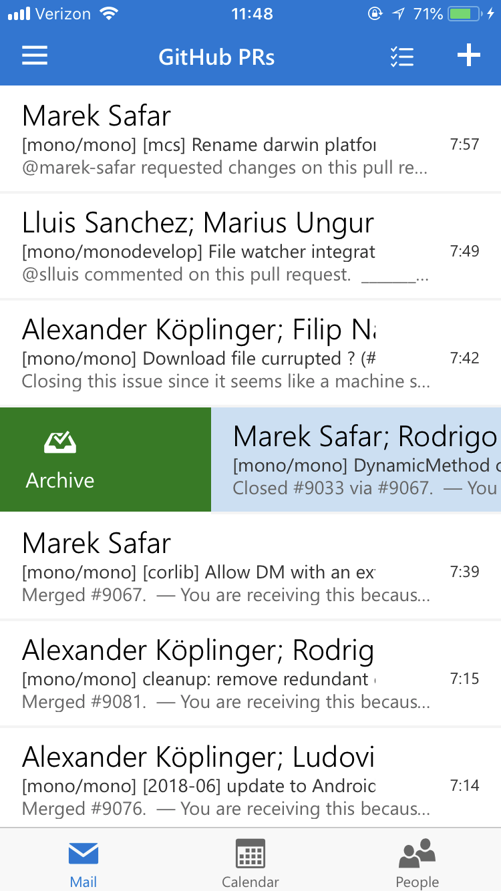

# Outtune Mail - a mildly improved Outlook Web Access for iOS

A very simple iOS app that hosts Outlook Web Access (OWA) simply so it can
sit in your iPhone dock and remind you that not too long ago you could use
the real iOS Outlook app (which was fantastic), but then your company
enforced MDM/InTune, and your world fell apart.

### Outtune Mail provides few "fixes" over the OWA experience in Safari:

* Since OWA is not a well-behaved SPA regarding navigation, there is
  explicit support for the "back" gesture - swiping will "tap" the > icon
  in the toolbar to go back a page. _This could be addressed by OWA itself_.

* Fixes main frame scroll bouncing that is annoying in Safari. OWA content
  scrolls in overflow'd divs and never scrolls the main frame, but Safari
  happily bounces the entire app when you reach the bottom. _This could
  be addressed by OWA itself._

* Blend the iOS status bar with the OWA toolbar. It's blue.

* External links open in Safari. I guess this isn't an improvement over
  Safari, but I wanted to point this out.

